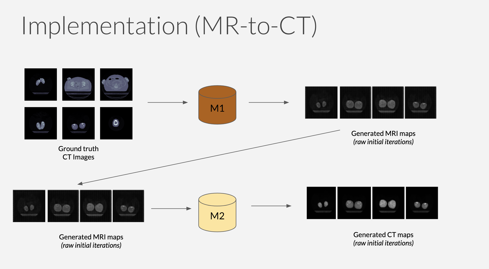
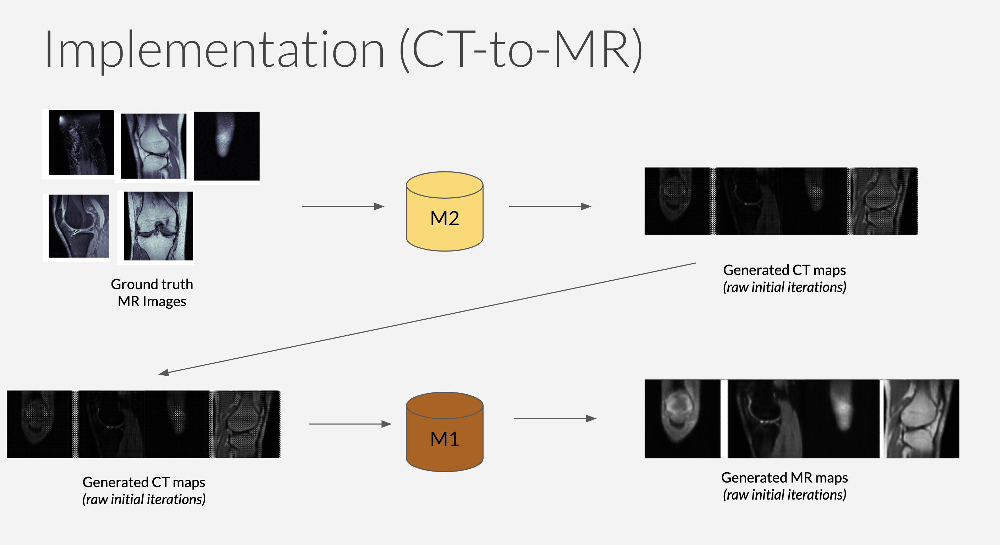

# DeepScan 

### Problem  
Low affordability, accessibility and availability of medical imaging diagnosis 

### Importance 
Essential for providing global, scalable and sustainable healthcare  diagnostic facilities in rural parts of the world

### Impact 
Low cost effective diagnosis implies early detection of health problems thereby improving the quality of a  patient’s life

## Implementation of CycleGAN
--------------------------

